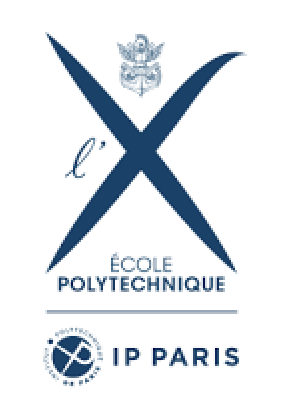



 

*École Polytechnique*, France
------

**2023-2025, Master Degree**

[Master of Science and Technology in Artificial Intelligence & Advanced Visual Computing](https://programmes.polytechnique.edu/en/master/all-msct-programs/artificial-intelligence-advanced-visual-computing-master)

GPA: 3.81/4.0

 

*Southern University of Science and Technology*, China
------

**2019-2023, Bachelor Degree**

Major in Intelligent Science and Technology

GPA: 3.66/4.0

Supervisor: [Hisao Ishibuchi](https://cse.sustech.edu.cn/faculty/~hisao/)
